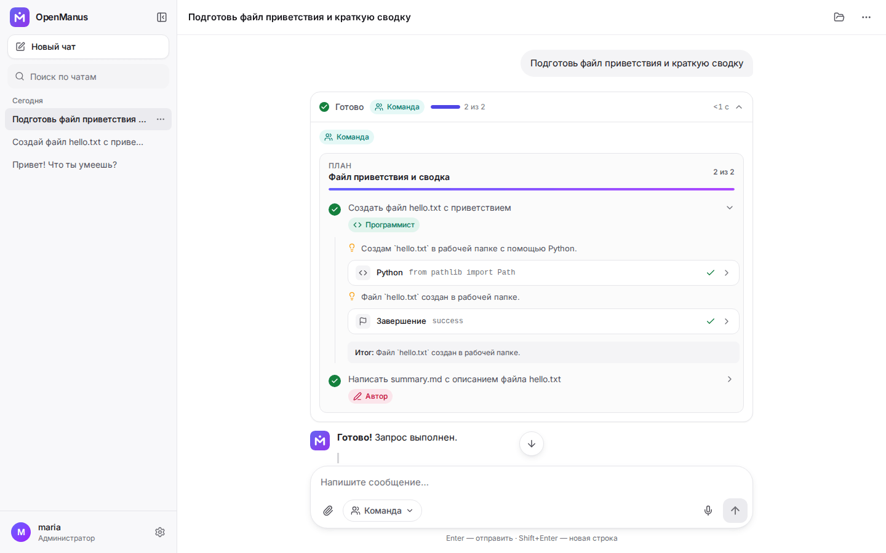
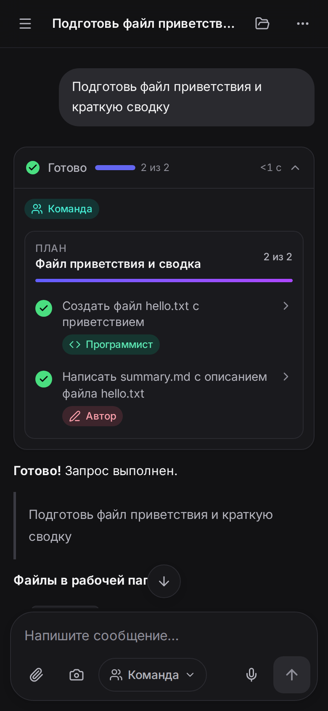
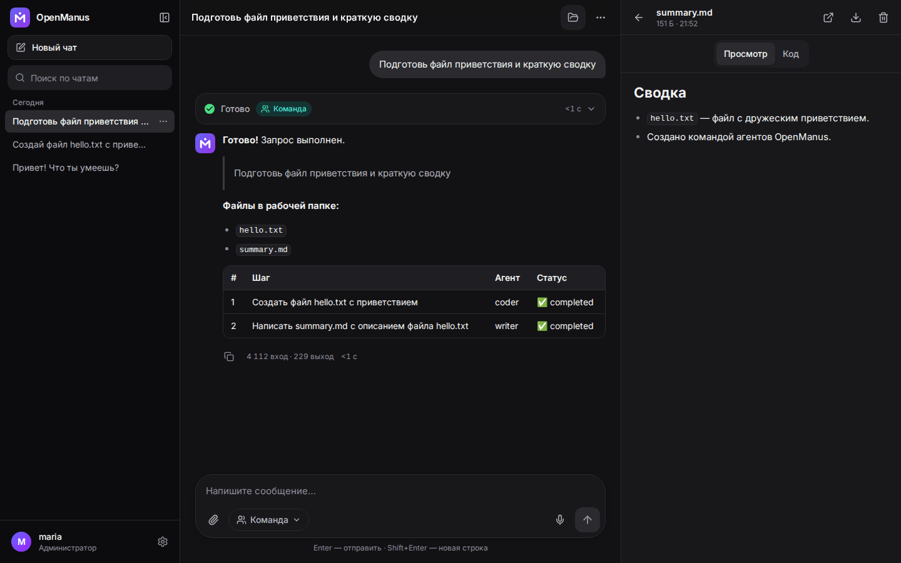
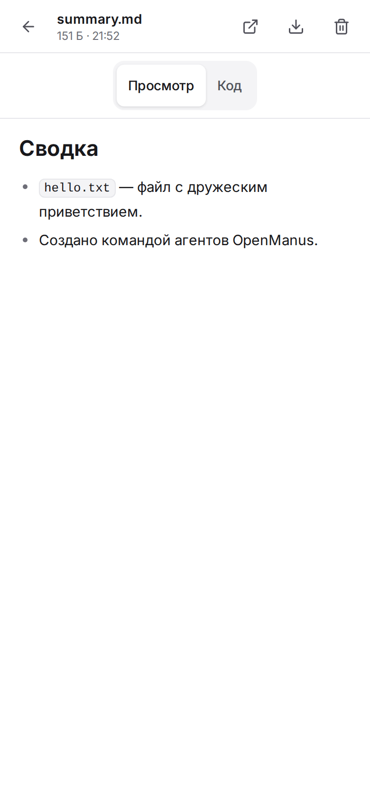
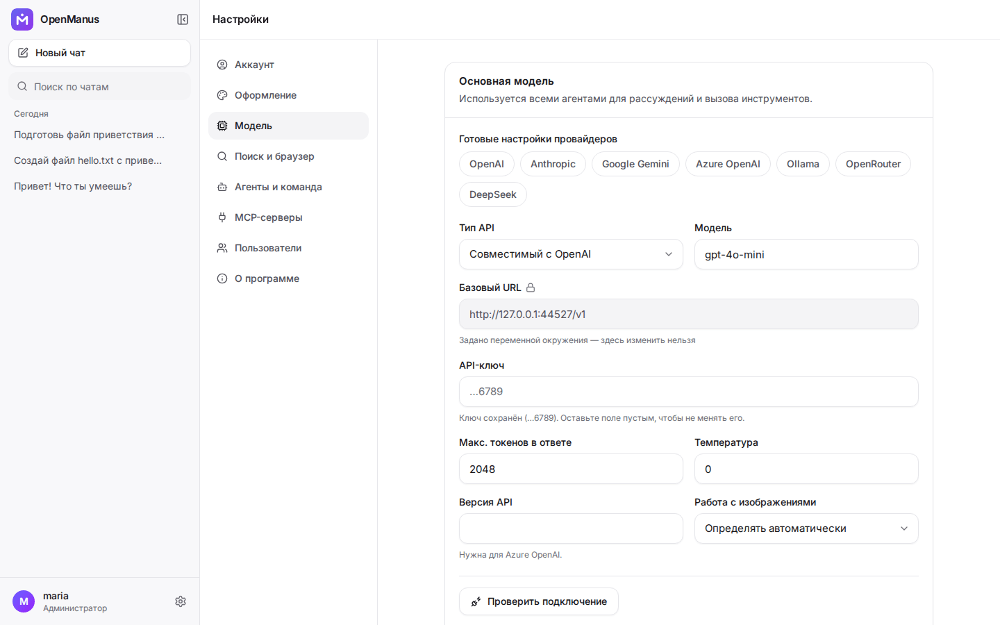
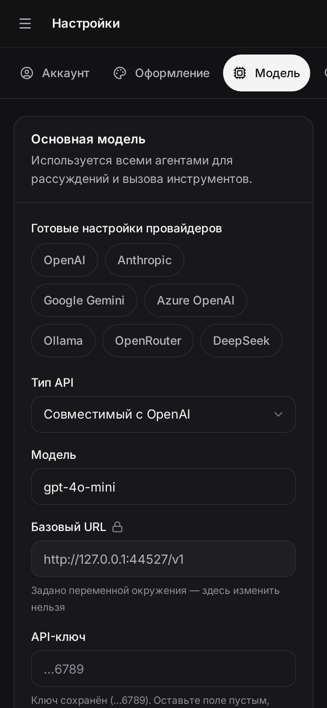
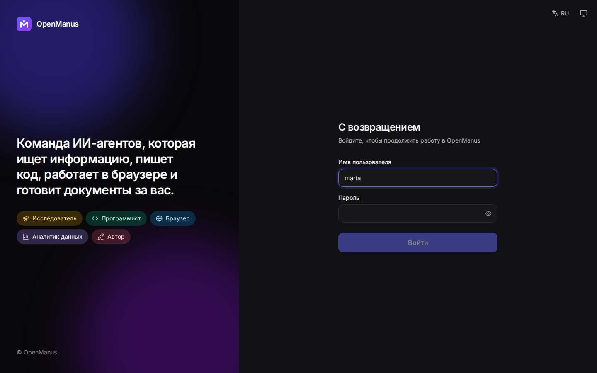
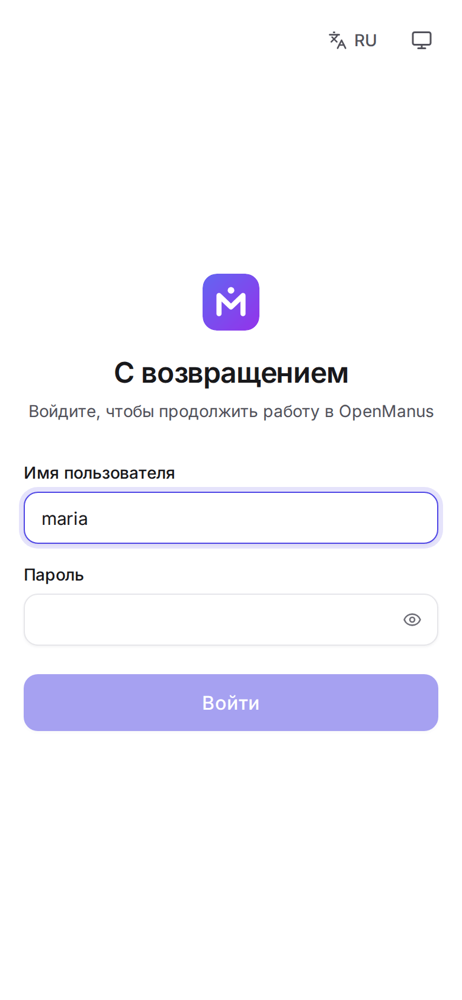

<p align="center">
  
</p>

[English](README.md) | [中文](README_zh.md) | [한국어](README_ko.md) | [日本語](README_ja.md) | Русский

[](https://github.com/FoundationAgents/OpenManus/stargazers)
&ensp;
[](https://opensource.org/licenses/MIT) &ensp;
[](https://discord.gg/DYn29wFk9z)
[](https://huggingface.co/spaces/lyh-917/OpenManusDemo)
[](https://doi.org/10.5281/zenodo.15186407)

# 👋 OpenManus

Manus — потрясающий проект, а OpenManus позволяет воплотить любую идею без *кода приглашения* 🛫!

Участники нашей команды [@Xinbin Liang](https://github.com/mannaandpoem) и [@Jinyu Xiang](https://github.com/XiangJinyu) (основные авторы), а также [@Zhaoyang Yu](https://github.com/MoshiQAQ), [@Jiayi Zhang](https://github.com/didiforgithub) и [@Sirui Hong](https://github.com/stellaHSR) — из [@MetaGPT](https://github.com/geekan/MetaGPT). Прототип был запущен за 3 часа, и мы продолжаем его развивать!

Это простая реализация, поэтому мы рады любым предложениям, вкладу и отзывам!

Пользуйтесь своим собственным агентом с OpenManus!

Также представляем [OpenManus-RL](https://github.com/OpenManus/OpenManus-RL) — открытый проект, посвящённый методам дообучения LLM-агентов на основе обучения с подкреплением (например, GRPO), который совместно развивают исследователи из UIUC и OpenManus.

## Демонстрация

<video src="https://private-user-images.githubusercontent.com/61239030/420168772-6dcfd0d2-9142-45d9-b74e-d10aa75073c6.mp4?jwt=eyJhbGciOiJIUzI1NiIsInR5cCI6IkpXVCJ9.eyJpc3MiOiJnaXRodWIuY29tIiwiYXVkIjoicmF3LmdpdGh1YnVzZXJjb250ZW50LmNvbSIsImtleSI6ImtleTUiLCJleHAiOjE3NDEzMTgwNTksIm5iZiI6MTc0MTMxNzc1OSwicGF0aCI6Ii82MTIzOTAzMC80MjAxNjg3NzItNmRjZmQwZDItOTE0Mi00NWQ5LWI3NGUtZDEwYWE3NTA3M2M2Lm1wND9YLUFtei1BbGdvcml0aG09QVdTNC1ITUFDLVNIQTI1NiZYLUFtei1DcmVkZW50aWFsPUFLSUFWQ09EWUxTQTUzUFFLNFpBJTJGMjAyNTAzMDclMkZ1cy1lYXN0LTElMkZzMyUyRmF3czRfcmVxdWVzdCZYLUFtei1EYXRlPTIwMjUwMzA3VDAzMjIzOVomWC1BbXotRXhwaXJlcz0zMDAmWC1BbXotU2lnbmF0dXJlPTdiZjFkNjlmYWNjMmEzOTliM2Y3M2VlYjgyNDRlZDJmOWE3NWZhZjE1MzhiZWY4YmQ3NjdkNTYwYTU5ZDA2MzYmWC1BbXotU2lnbmVkSGVhZGVycz1ob3N0In0.UuHQCgWYkh0OQq9qsUWqGsUbhG3i9jcZDAMeHjLt5T4" data-canonical-src="https://private-user-images.githubusercontent.com/61239030/420168772-6dcfd0d2-9142-45d9-b74e-d10aa75073c6.mp4?jwt=eyJhbGciOiJIUzI1NiIsInR5cCI6IkpXVCJ9.eyJpc3MiOiJnaXRodWIuY29tIiwiYXVkIjoicmF3LmdpdGh1YnVzZXJjb250ZW50LmNvbSIsImtleSI6ImtleTUiLCJleHAiOjE3NDEzMTgwNTksIm5iZiI6MTc0MTMxNzc1OSwicGF0aCI6Ii82MTIzOTAzMC80MjAxNjg3NzItNmRjZmQwZDItOTE0Mi00NWQ5LWI3NGUtZDEwYWE3NTA3M2M2Lm1wND9YLUFtei1BbGdvcml0aG09QVdTNC1ITUFDLVNIQTI1NiZYLUFtei1DcmVkZW50aWFsPUFLSUFWQ09EWUxTQTUzUFFLNFpBJTJGMjAyNTAzMDclMkZ1cy1lYXN0LTElMkZzMyUyRmF3czRfcmVxdWVzdCZYLUFtei1EYXRlPTIwMjUwMzA3VDAzMjIzOVomWC1BbXotRXhwaXJlcz0zMDAmWC1BbXotU2lnbmF0dXJlPTdiZjFkNjlmYWNjMmEzOTliM2Y3M2VlYjgyNDRlZDJmOWE3NWZhZjE1MzhiZWY4YmQ3NjdkNTYwYTU5ZDA2MzYmWC1BbXotU2lnbmVkSGVhZGVycz1ob3N0In0.UuHQCgWYkh0OQq9qsUWqGsUbhG3i9jcZDAMeHjLt5T4" controls="controls" muted="muted" class="d-block rounded-bottom-2 border-top width-fit" style="max-height:640px; min-height: 200px"></video>

## 🌐 Веб-интерфейс (компьютер и телефон)

OpenManus можно развернуть на своём сервере как многопользовательское веб-приложение:

- **Чат с командой агентов.** Универсальный Manus, Браузер, Исследователь, Программист,
  Аналитик данных, Автор и облачная Песочница (Daytona) работают поодиночке или вместе:
  режим «Авто» сам выбирает, ответить ли сразу, поручить задачу одному агенту или составить план
  для команды.
- **Всё видно в реальном времени:** план и его выполнение, рассуждения агентов, вызовы
  инструментов, скриншоты браузера, итоговый ответ появляется по мере генерации; задачу можно
  остановить и повторить.
- **Файлы чата:** загружайте документы и данные, смотрите и скачивайте то, что создали агенты
  (изображения, код, Markdown, PDF, HTML-страницы, архив целиком).
- **Вопросы от агентов** приходят прямо в чат (и уведомлением, если вкладка в фоне).
- Несколько пользователей с отдельными чатами, администрирование, настройка модели в интерфейсе.
- Интерфейс на русском и английском, светлая и тёмная темы, голосовой ввод.
- **Устанавливается на телефон** как приложение (Android и iOS) и на компьютер.

<table>
  <tr>
    <td width="74%"></td>
    <td width="26%"></td>
  </tr>
</table>

<details>
<summary>Ещё скриншоты: файлы, настройки, вход (светлая и тёмная темы)</summary>

| | Компьютер | Телефон |
|---|---|---|
| Файлы |  |  |
| Настройки |  |  |
| Вход |  |  |

Все скриншоты (обе темы, оба языка) лежат в [docs/screenshots](docs/screenshots); они снимаются с
работающего приложения командой `scripts/e2e.sh --screenshots`.
</details>

Быстрый запуск на сервере с Docker (из каталога репозитория):

```bash
cp .env.example .env
docker compose up -d --build
docker compose exec openmanus cat /data/initial_admin_password.txt
```

Откройте `http://<адрес-сервера>:8000`, войдите как `admin` с показанным паролем и подключите
модель в **«Настройки» → «Модель»** (OpenAI, Anthropic, OpenRouter, DeepSeek, Gemini, Azure,
Bedrock или Ollama).

- **[Подробное руководство по развёртыванию](docs/DEPLOY.md)** — для тех, кто делает это
  впервые: аренда VPS, установка Docker, домен и HTTPS, первый вход, подключение модели,
  установка на телефон, пользователи, резервные копии, обновление, решение проблем, безопасность.
- [Архитектура](docs/ARCHITECTURE.md) (англ.) — компоненты, события, жизненный цикл задачи,
  добавление агентов и инструментов.

## Установка (консольная версия)

Мы предлагаем два способа установки. Рекомендуется способ 2 (с uv): он быстрее и лучше управляет зависимостями.

### Способ 1: с помощью conda

1. Создайте новое окружение conda:

```bash
conda create -n open_manus python=3.12
conda activate open_manus
```

2. Клонируйте репозиторий:

```bash
git clone https://github.com/FoundationAgents/OpenManus.git
cd OpenManus
```

3. Установите зависимости:

```bash
pip install -r requirements.txt
```

### Способ 2: с помощью uv (рекомендуется)

1. Установите uv (быстрый установщик Python-пакетов):

```bash
curl -LsSf https://astral.sh/uv/install.sh | sh
```

2. Клонируйте репозиторий:

```bash
git clone https://github.com/FoundationAgents/OpenManus.git
cd OpenManus
```

3. Создайте и активируйте виртуальное окружение:

```bash
uv venv --python 3.12
source .venv/bin/activate  # Unix/macOS
# В Windows:
# .venv\Scripts\activate
```

4. Установите зависимости:

```bash
uv pip install -r requirements.txt
```

### Инструмент автоматизации браузера (необязательно)

```bash
playwright install
```

## Настройка

OpenManus нужно указать параметры API языковых моделей:

1. Создайте файл `config.toml` в каталоге `config` (можно скопировать из примера):

```bash
cp config/config.example.toml config/config.toml
```

2. Отредактируйте `config/config.toml`: добавьте свои API-ключи и измените настройки:

```toml
# Глобальная настройка LLM
[llm]
model = "gpt-4o"
base_url = "https://api.openai.com/v1"
api_key = "sk-..."  # Замените на свой API-ключ
max_tokens = 4096
temperature = 0.0

# Необязательная настройка отдельных моделей
[llm.vision]
model = "gpt-4o"
base_url = "https://api.openai.com/v1"
api_key = "sk-..."  # Замените на свой API-ключ
```

В веб-версии этот файл редактировать вручную не нужно: модель настраивается в интерфейсе.

## Быстрый старт

Запуск OpenManus одной командой:

```bash
python main.py
```

Затем введите свою задачу в терминале!

Версия с инструментами MCP:

```bash
python run_mcp.py
```

Экспериментальная многоагентная версия:

```bash
python run_flow.py
```

### Добавление нескольких агентов

Помимо универсального агента OpenManus, интегрирован агент DataAnalysis, который подходит для
анализа и визуализации данных. Его можно добавить в `run_flow` в `config.toml`:

```toml
# Необязательная настройка run-flow
[runflow]
use_data_analysis_agent = true     # По умолчанию выключено; true — включить
```

Также установите зависимости, необходимые для работы агента: [подробная инструкция по установке](app/tool/chart_visualization/README.md##Installation)

## Как внести вклад

Мы рады любым дружелюбным предложениям и полезному вкладу! Создавайте issues или отправляйте pull requests.

Или свяжитесь с @mannaandpoem по 📧 почте: mannaandpoem@gmail.com

**Примечание:** перед отправкой pull request проверьте изменения инструментом pre-commit:
выполните `pre-commit run --all-files`.

## Сообщество

Присоединяйтесь к нашей группе в Feishu и делитесь опытом с другими разработчиками!

<div align="center" style="display: flex; gap: 20px;">
    
</div>

## История звёзд

[](https://star-history.com/#FoundationAgents/OpenManus&Date)

## Спонсоры

Благодарим [PPIO](https://ppinfra.com/user/register?invited_by=OCPKCN&utm_source=github_openmanus&utm_medium=github_readme&utm_campaign=link) за предоставленные вычислительные ресурсы.
> PPIO: самое доступное и легко интегрируемое решение MaaS и GPU-облака.

## Благодарности

Спасибо [anthropic-computer-use](https://github.com/anthropics/anthropic-quickstarts/tree/main/computer-use-demo), [browser-use](https://github.com/browser-use/browser-use) и [crawl4ai](https://github.com/unclecode/crawl4ai) за базовую поддержку этого проекта!

Мы также благодарны [AAAJ](https://github.com/metauto-ai/agent-as-a-judge), [MetaGPT](https://github.com/geekan/MetaGPT), [OpenHands](https://github.com/All-Hands-AI/OpenHands) и [SWE-agent](https://github.com/SWE-agent/SWE-agent).

Благодарим stepfun (阶跃星辰) за поддержку нашего демо-пространства на Hugging Face.

OpenManus создан участниками MetaGPT. Огромное спасибо этому сообществу агентов!

## Цитирование

```bibtex
@misc{openmanus2025,
  author = {Xinbin Liang and Jinyu Xiang and Zhaoyang Yu and Jiayi Zhang and Sirui Hong and Sheng Fan and Xiao Tang and Bang Liu and Yuyu Luo and Chenglin Wu},
  title = {OpenManus: An open-source framework for building general AI agents},
  year = {2025},
  publisher = {Zenodo},
  doi = {10.5281/zenodo.15186407},
  url = {https://doi.org/10.5281/zenodo.15186407},
}
```
